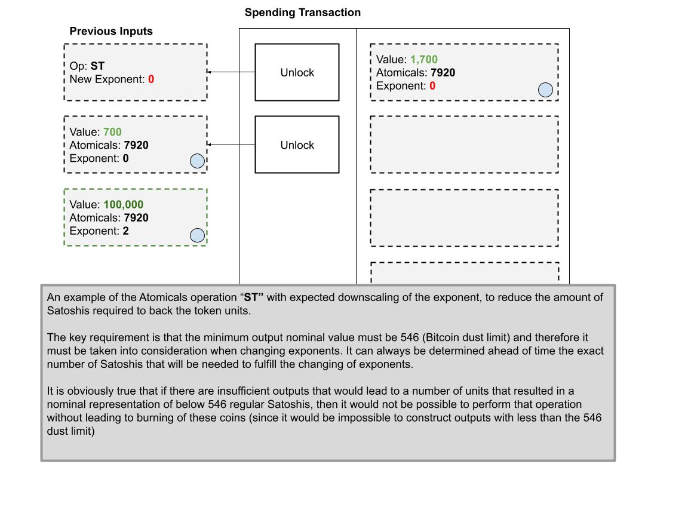
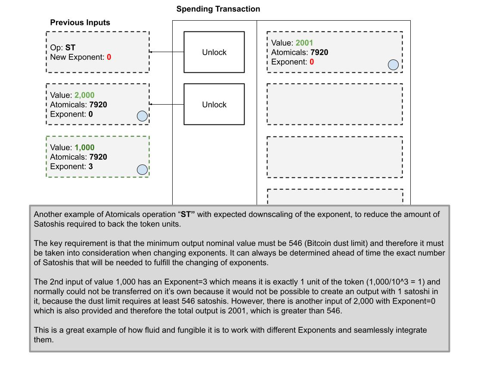

# Substantiation Factor

**Problem:** It is not possible to transfer less than 546 satoshis in a single UTXO with Bitcoin due to the dust limit, and therefore it is not possible to transfer ARC20 tokens in denominations less than 546, which can be prohibitive for many users and applications.

⚡ **Solution:** Introduce a _SUBSTANTIATION FACTOR (SF)_ that redefines how many Satoshis are needed to back a single unit of an ARC20 token. The default substantiation factor is 1:1 and arbitrary precision must be feasible to facilitate making transfers involving less than 546 units of a token.

## Operation: "ST" - Substantiate Token

A new operation is created that allows the re-substantiation of token units from 1:1 to 1:10, 1:100, etc... Effectively allowing the owner of the token to "split" or "fractionalize" their token units to arbitrary precision - with one catch: they must provide the regular Satoshis as the collateral or backing of the token units direclty in proportion to their desired factor.

The default operation of ARC20 is to have 0 decimals, or a 1:1 substantation. We can define this as an Exponent of 0 in the calculation `10^0 = 1`

We can then see we can "rescale" or "re-substantiation" by different factors, by changing the exponent to give decimal places.

Consider the table of Exponents to represent token units with 1:1 backing, then 1:10, then 1:100 satoshis, etc and so on.

```
10^0 = 1
10^1 = 10
10^2 = 100
10^3 = 1,000
10^4 = 10,000
10^5 = 100,000
```

For example, if we wish to trade 1 unit of a token, while still respect the dust limit. Then we simply need to substantiate each unit of the token with 1,000 regular satoshis and then we can perform a transfer of 1,000 satoshis with Exponent=3.&#x20;

An example will demonstrate how this works, preserving the fungibility and fluidity of the ARC20 transfers.


<figure><figcaption></figcaption></figure>

In the event there are multiple inputs with different exponents, we can easily handle them too:


<figure><figcaption></figcaption></figure>

An example to "downscale" to a lower exponent


<figure><figcaption></figcaption></figure>

And one more example to demonstrate the downscaling to make the point extra clear


<figure><figcaption></figcaption></figure>

## Transfers without Operation "ST"

When the Operation "ST" is not used, then the highest Exponent is taken as the target Exponent, that's all there is to it.

<figure><figcaption></figcaption></figure>
