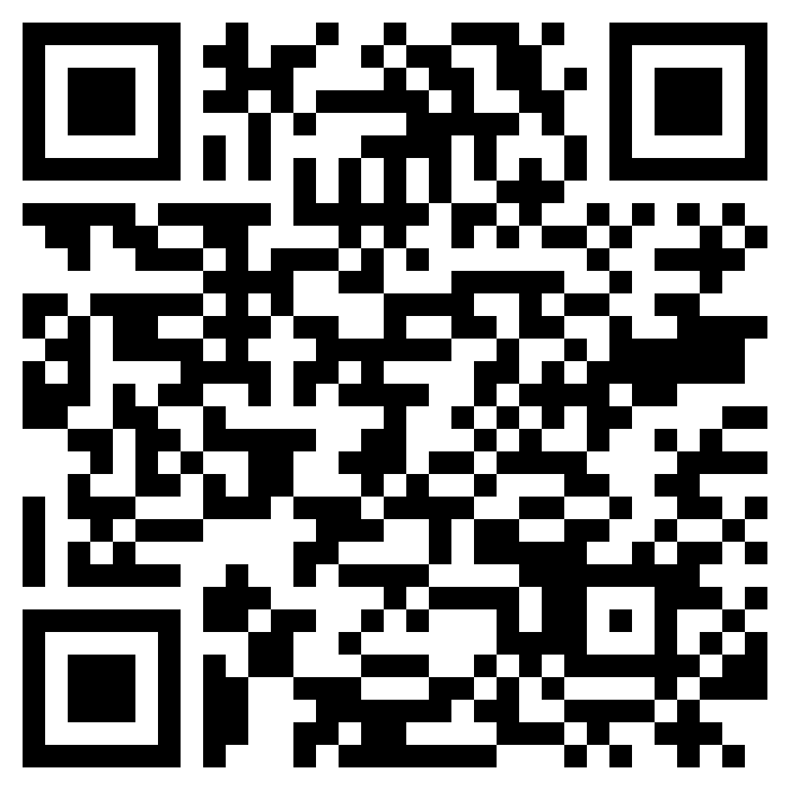

# FAQ

## What is the Atomicals Protocol?&#x20;

Atomicals Protocol is the most simple, flexible and secure way of creating digital objects on Bitcoin. Every Atomical is a self-evident and tamper resistant chain of digital signatures, it is a robust file format for every use imaginable. Everything on the internet can now potentially be owned digital property.&#x20;

## Does Atomicals require a separate chain, additional layers or any changes to Bitcoin?&#x20;

No! It's here now and works on native Bitcoin and existing wallets today. It leverages the key design of Bitcoin and requires no secondary layers, side-chains and no trusted services to operate. &#x20;

## What can Atomicals Digital Objects be used for?

Atomicals is designed for the most demanding security requirements with zero room for error. Digital Objects perfect for everything from digital art, authentication schemes to virtual land and title registries and social media such as:

* Digital collectibles, media and art
* Digital identity, authentication and token-gated content
* Web hosting and file storage
* Peer to peer exchange and atomic swaps
* Digital namespace allocation
* Virtual land and title registries
* Dynamic objects and state for games
* Social media profiles, posts and communities

The heart of Atomicals is a few key simple rules to follow for mint, transfer, and update operations, continue reading to the Protocol Overview to understand the high level flow before diving deeper.  If you like, you can just [skip all the theory and go straight to minting your first Atomical within a couple of minutes.](reference-and-tools/javascript-library-cli.md)

## How does Atomicals Protocol work?&#x20;

Learn more about how the protocol works by visiting the Protocol Specification page.


[specification.md](reference-and-tools/specification.md)


## Why are Atomicals called "digital objects" instead of "NFTs"?

A non-fungible token (NFT) is a highly technical term that does not convey the diverse set of usages available. Atomicals uses the term "digital objects" to elicit all of the potential uses of the protocol. It is far more familiar to the average person and is also very developer friendly in the sense that we already work with digital objects and understand their properties.

## Where can I learn more and discuss the Atomicals Protocol?

Learn more at the [BIP](https://github.com/atomicals/atomicals-project/blob/main/bip.mediawiki)

Where can I donate to support Atomicals Protocol development?

## Donate to Atomicals Development

We greatly appreciate any donation to help support Atomicals Protocol development. We worked out of passion and kindness for the world, we believe this technology must exist and be free for all to use. Bitcoin is our one hope for freedom and digital sovereignty and we intend to do our best to make it a reality.

Note: All donations are voluntary are an expression of gratitude for past work completed. There is no expectation of any features or development goals. Show your appreciation with a donation of any kind or amount.

BTC: bc1pa5hvv3w3wjwfktd63zcng6yeccxg9aa90e34n9jrjw3thgc52reqxw6has

<figure><figcaption>
BTC Donation address: bc1pa5hvv3w3wjwfktd63zcng6yeccxg9aa90e34n9jrjw3thgc52reqxw6has
</figcaption></figure>

