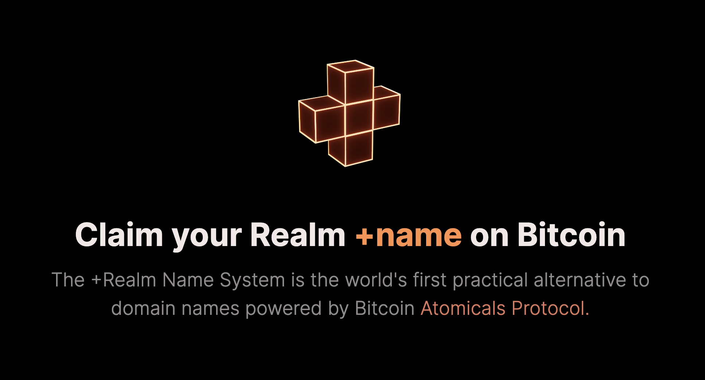

# Realm Names

This section describes how to mint a special type of Atomical digital object called a _Realm._ You can query and search Realm names on [https://realm.name](https://realm.name)&#x20;

<figure><figcaption><p>Claim your Realm +name on Bitcoin @ <a href="https://realm.name">https://realm.name</a></p></figcaption></figure>

> **-> What is a **_**Realm**_**?**
>
> Realm Names are human-readable identifiers which can be used to associate network addresses and resource information. A Realm name begins with the plus `+` sign and has at least one alphabetical character, such as `+alice` and `+agent007` which are both valid names _(top-level-realms or TLRs)_ in the Realm Name System (RNS). Realm names are self-owned and self-managed directly on the Bitcoin blockchain using the Atomicals Digital Object format — which basically means that there is no middle man or centralized registrar. Once you claim a name, it's yours forever or until you transfer it to someone else.

###

<figure><figcaption></figcaption></figure>

### Mint Realm

Before using the commands below you must first create a local wallet using the `wallet-init` command. For convenience the commands.

#### Step 1. Download and Install atomicals-js CLI

Download and install the [atomicals-js](https://github.com/atomicals/atomicals-js) CLI.

<pre><code><strong>git clone https://github.com/atomicals/atomicals-js.git
</strong><strong>cd atomicals-js
</strong><strong>npm install
</strong><strong>npm run build
</strong></code></pre>

#### Step 2. Wallet Initialize

The purpose of the wallet is to create p2tr (pay-to-taproot) spend scripts and to receive change from the transactions made for the various operations. _Do not put more funds than you can afford to lose, as this is still beta!_

To initialize a new `wallet.json` file that will store your address for receiving change use the `wallet-init` command.&#x20;

```
npm run cli wallet-init

>>>

Wallet created at wallet.json
phrase: maple maple maple maple maple maple maple maple maple maple maple maple
Legacy address (for change): 1FXL2CJ9nAC...u3e9Evdsa2pKrPhkag
Derive Path: m/44'/0'/0'/0/0
WIF: L5Sa65gNR6QsBjqK.....r6o4YzcqNRnJ1p4a6GPxqQQ
------------------------------------------------------
```

#### Step 3. Mint Realm&#x20;

The basic format to mint a Realm name using the [Atomicals CLI ](../reference-and-tools/javascript-library-cli.md)is:

<pre><code><strong>npm run cli mint-realm "myrealmname"
</strong>
Optional flags:
--satsbyte=&#x3C;number>
</code></pre>

The realm mint function `mint-realm` allows minting for Realm `myrealmname` as long as you are the first to claim it.

Follow the on-screen instructions to pay and mint.

**Required Parameters:**

_realmname:_ The globally unique realm name

**Optional Flags:**

_--satsbyte=\<number>_

Set the satoshis per byte for the transaction and override the default.

#### Step 4. Query Realm name

You must wait 3 confirmations for the name to be claimed and registered correctly. After it is claimed, you can query the realm name with the command:

<pre><code><strong>npm run cli get +myrealmname
</strong></code></pre>

You may also query and search Realm names on [https://realm.name](https://realm.name)

#### Step 5. Query global feed (optional)

You can query the global feed of registered Realms and Atomicals:

<pre><code><strong>npm run cli list
</strong></code></pre>

<details>

<summary>⚡ Get started and mint your first Atomical Digital Object</summary>

[Download and install the Atomicals Javascript CLI tool](https://github.com/atomicals/atomicals-js) and follow the quick start instructions to mint your NFT, Collection, or Realm name in less than 2 minutes.

</details>


\


